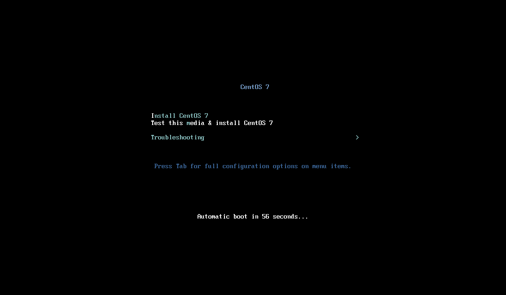
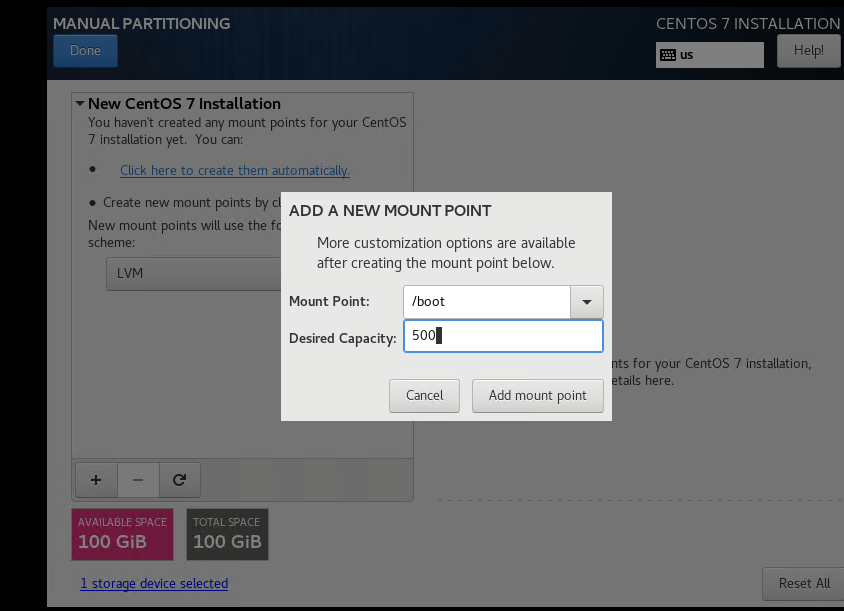
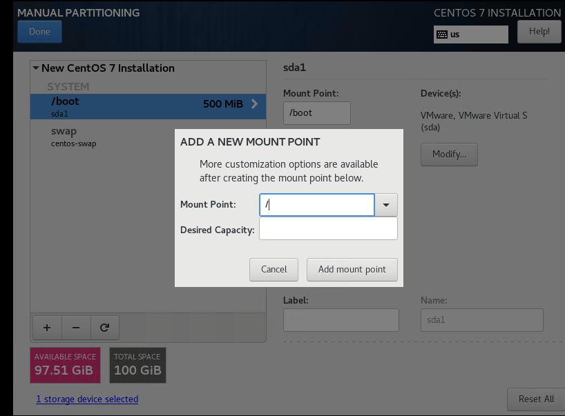
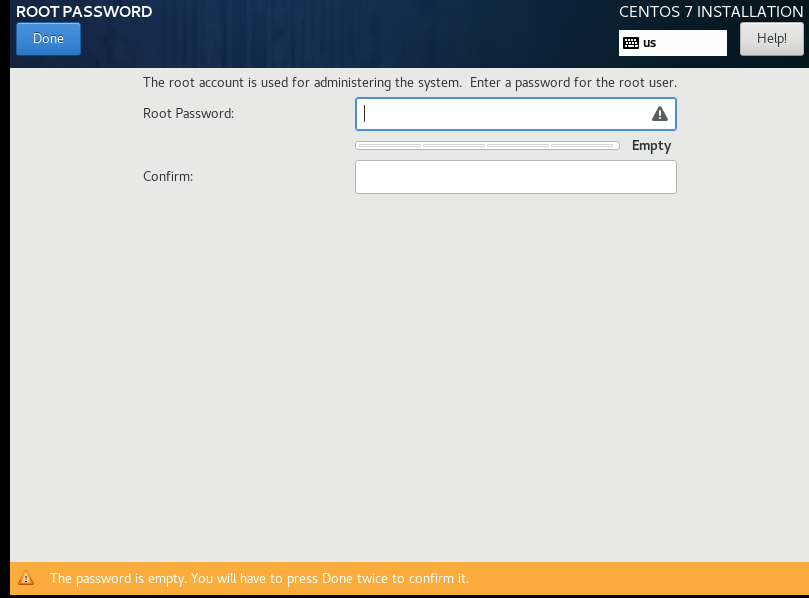
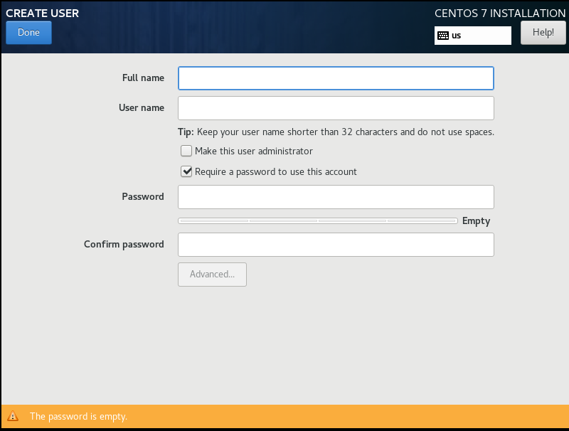

# CentOS  Tutorial

## Introduce
CentOS 是一个基于Red Hat Linux 提供的可自由使用源代码的企业级Linux发行版本。

Home:http://www.centos.org
## Download
- 当前最新版本下载地址：https://www.centos.org/download/
- 档案版本下载地址：http://wiki.centos.org/Download

本文基于 `7.6.xxx` 版本，ISO镜像下载地址：http://isoredirect.centos.org/centos/7/isos/x86_64/CentOS-7-x86_64-DVD-1810.iso
## Installation Steps
1. 开机启动界面，选择Install CentOS 7 安装CentOS 7
  
  
 
界面说明：
 - Install CentOS 7 安装CentOS 7
 - Test this media & install CentOS  7 测试安装文件并安装CentOS 7
 - Troubleshooting 修复故障
 
2. 选择安装语言,默认English，English(United States)，点击Continue继续： 

  

3. 选择安装时间`LOCALIZATION -> DATE & TIME`，设置为`Asia/Shanghai`亚洲/上海

  

4. 选择系统安装位置`SYSTEM -> INSTALLATION DESTINATION`，配置分区

  
    
   - 4.1 新建`/boot`：`500MB`
   
    
   - 4.2 新建`swap`：`2GB`(当前内存的2倍)
   
    
   - 4.3 新建 `/`: `空` (自动分配所有剩余空间）  
   
    
5. 选择配置ip地址 `NETWORK & HOSTNAME`

  

6. 开始安装，安装过程中设置root密码，`USER SETTINGS -> ROOT PASSWORD`以及选择创建用户，`USER SETTINGS -> USER CREATION`
  
  

   - 6.1 设置root密码 `USER SETTINGS -> ROOT PASSWORD`
   
   
   - 6.1 创建用户`USER SETTINGS -> CREATE USER`
   

7. 点击Reboot重启完成安装

  

## Settings

## Keymap
- 开关机指令
```tcl
shutdown -h now #立刻关机
shutdown -h 10 #将于10分钟后关闭，且会显示在登录用户的当前屏幕中
shutdown -h 22:22 #将于指定时刻关机
shutdown -r now #立刻重启
shutdown -r +10 #将于10分钟后重启
reboot #重启
halt #关机
init 0
init 6
```
- 防火墙指令
```
默认防火墙Firewall指令
service firewalld start     #启动防火墙
service firewalld stop      #关闭防火墙
firewall-cmd --state        #查看防火墙状态，是否开启
systemctl status firewalld  #查看服务状态
systemctl enable firewalld.service   #设置开机自动启动
systemctl disable firewalld.service  #关闭开机自动启动

```
## IP and DNS
1. 查看IP分配情况
```tcl
CentOS最小化安装 没有ifconfig命令。
# ifconfig 
# ip addr
```
2. 编辑ifcfg-ens33
```tcl
# cd /etc/sysconfig/network-scripts
# vi /etc/sysconfig/network-scripts/ifcfg-ens33
```
i 进入编辑模式，编辑后按Esc键，输入:wq 保存并退出
```powershell
BOOTPROTO=static        # dhcp -> static
ONBOOT=yes              # no -> yes，开机启用本配置，一般在最后一行
IPADDR=10.10.6.128      # 新增，静态IP
GATEWAY=10.10.6.1       # 新增，默认网关
NETMASK=255.255.255.0   # 新增，子网掩码
NM_CONTROLLED=no        # 新增，该接口通过配置文件进行设置，而不是通过网络管理器进行管理
DNS1=223.5.5.5          # 新增，DNS配置
DNS2=202.98.0.68
```


3. 重启网络服务
```tcl
# service network restart
# systemctl restart network.service
```
4. 验证网络配置

```tcl
# ping www.baidu.com
# ping -c 10 www.baidu.com
```
- ping -c N URL 表示ping N次后自动结束，其中N为正整数
- ctrl + C 退出ping命令
## Rources
+ https://www.osyunwei.com/archives/7829.html
