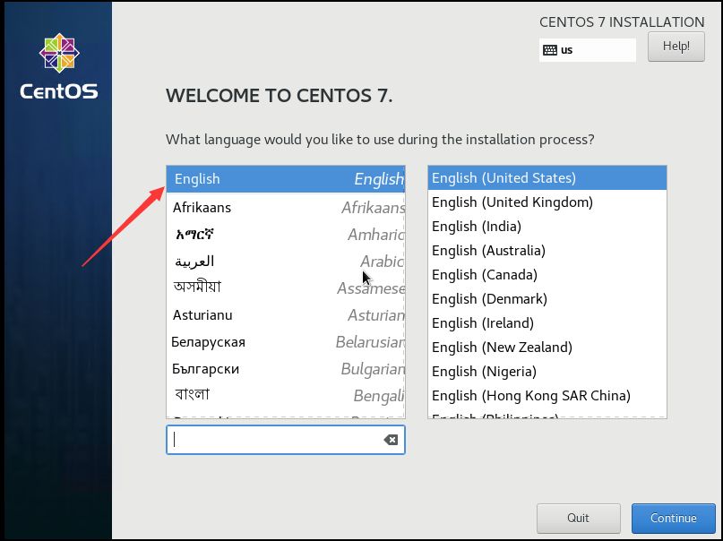
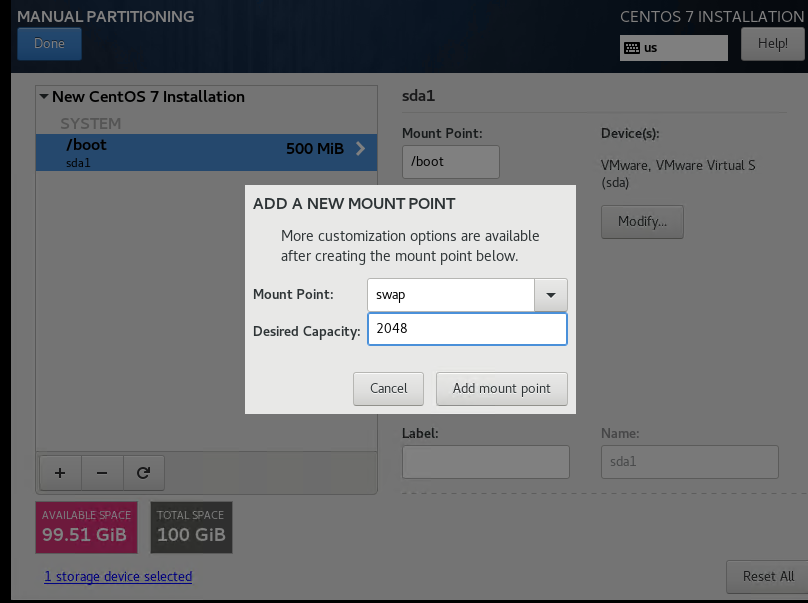

# CentOS  Tutorial

## Introduce
CentOS 是一个基于Red Hat Linux 提供的可自由使用源代码的企业级Linux发行版本。

Home: http://www.centos.org
## Download
- 当前最新版本下载地址：https://www.centos.org/download/
- 档案版本下载地址：http://wiki.centos.org/Download

CentOS各版本之间的区别：
- CentOS-7-x86_64-DVD-xxxx.iso (标准安装包，约4G)
- CentOS-7-x86_64-NetInstall-xxxx.iso (网络安装镜像)
- CentOS-7-x86_64-Everything-xxxx.iso (对完整版安装盘的软件进行补充，集成所有软件，约8G)
- CentOS-7-x86_64-LiveGNOME-xxxx.iso 或 CentOS-7-x86_64-LiveKDE-xxxx.iso (GNOME 或 KDE 桌面版)
- CentOS-7-x86_64-Minimal-xxxx.iso (最小安装，只有必要的软件，自带的软件最少，约1G)

本文基于 `7.6.xxx` 版本，ISO镜像下载地址：http://isoredirect.centos.org/centos/7/isos/x86_64/CentOS-7-x86_64-DVD-1810.iso
## Installation Steps
1. 开机启动界面，选择 `Install CentOS 7` 安装CentOS 7
  
  
 
界面说明：
 - `Install CentOS 7` 安装CentOS 7
 - `Test this media & install CentOS 7` 测试安装文件并安装CentOS 7
 - `Troubleshooting` 修复故障
 
2. 选择安装语言,默认English，English(United States)，点击Continue继续： `正式生产服务器建议安装英文版本`

   

3. 选择安装时间 `LOCALIZATION -> DATE & TIME`，设置为 `Asia/Shanghai` 亚洲/上海

   
   
   `SOFTWARE SELECTION` 默认值(Minimal Install,最小化安装，不包含图形界面)

4. 选择系统安装位置 `SYSTEM -> INSTALLATION DESTINATION`，进入磁盘分区界面，配置分区

   
    
   - 4.1 新建`/boot`：`500MB`
   
    
   - 4.2 新建交换分区`swap`：`2GB`(一般设置为内存的2倍)
   
    
   - 4.3 新建 `/`: `空` (自动分配所有剩余空间）
   
   
   - 4.4 其他
        - +`/boot` 引导分区，包含引导系统所需的静态文件，例如Linux内核文件，还有一些引导菜单与开机所需配置文件等等，推荐大小500M。
        - +`swap` 交换分区，本应该根据内存大小划分，一般服务器配置较高，划分4~8G备用即可。
        - +`/data`分区在生产服务器建议单独划分出来用于存放数据` 
        - +`/var` 用于变化的数据，像日志、缓存等，推荐还是单独划分出来。如果不分则默认在 `/` 目录下。随着系统的使用该分区会越来越大，空间需求量还是比较大的，特别是一些高负载应用将产生大量日志，推荐100G。
        - `/boot/efi` 固件为UEFI时，必须存在，推荐大小200M。
        - `/biosboot` 硬盘采用GPT分区，而固件为BIOS时，必须存在，推荐大小2M。 
        - `/tmp` 放置一些临时文件和程序运行中的临时文件，一些运行高负载的服务器建议划分出来，推荐大小100G。
        - 建议不要把硬盘全部空间划分，留一部分备用，扩容。

5. 开始安装，安装过程中选择`USER SETTINGS -> ROOT PASSWORD` 设置root密码，以及选择`USER SETTINGS -> USER CREATION`创建用户。
  
   

   - 5.1 设置root密码 ，密码长度至少8位。
   
   
   - 5.2 创建用户
   

6. 点击Reboot重启完成安装

   

## Settings

## Keymap
- 开关机指令
```tcl
shutdown -h now #立刻关机
shutdown -h 10 #将于10分钟后关闭，且会显示在登录用户的当前屏幕中
shutdown -h 22:22 #将于指定时刻关机
shutdown -r now #立刻重启
shutdown -r +10 #将于10分钟后重启
reboot #重启
halt #关机
init 0
init 6
```
- 防火墙指令
```
默认防火墙Firewall指令
service firewalld start     #启动防火墙
service firewalld stop      #关闭防火墙
firewall-cmd --state        #查看防火墙状态，是否开启
systemctl status firewalld  #查看服务状态
systemctl enable firewalld.service   #设置开机自动启动
systemctl disable firewalld.service  #关闭开机自动启动

```
## Rources
+ https://www.osyunwei.com/archives/7829.html
