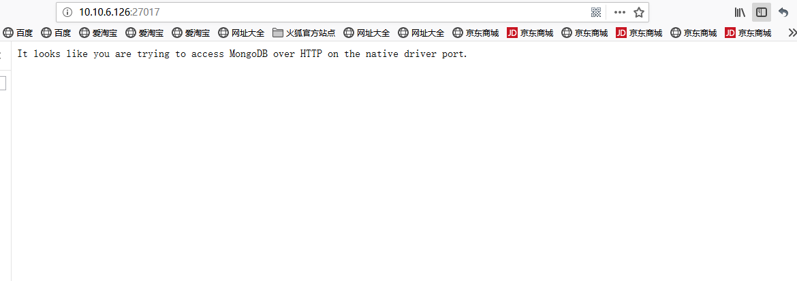

# MongoDB-Linux Tutorial

## Introduce

Home: https://www.mongodb.com/
## Download
版本下载地址为：https://www.mongodb.com/download-center/community

本文基于`v4.0.4`版本，下载地址
https://fastdl.mongodb.org/linux/mongodb-linux-x86_64-4.0.4.tgz
## Installation Steps
### 前置条件
```
# 在/usr/local下创建文件夹mongodb，作为安装目录
cd /usr/local                        
mkdir mongodb                    
# 在mongodb文件夹下创建data/db，用于存储数据库，创建logs，用于存放日志
cd mongodb
mkdir -p data/db
mkdir logs
# 本文使用wget在线安装MongoDB，如未安装请安装：
yum -y install wget
```
### 安装步骤

1. 在/usr/local目录下，使用wget 在线下载mongodb-linux-x86_64-4.0.4.tgz包
```
    cd /usr/local                  
    wget https://fastdl.mongodb.org/linux/mongodb-linux-x86_64-rhel70--4.0.4.tgz   
```
2. 解压`mongodb-linux-x86_64-rhel70-4.0.4.tgz` 二进制包
```
   tar -zxvf mongodb-linux-x86_64-rhel70-4.0.4.tgz       
```
3. 将`mongodb-linux-x86_64-rhel70-4.0.4` 文件夹下的全部内容移动到/use/local/mongodb文件夹下
```
    mv mongodb-linux-x86_64-rhel70-4.0.4/* /usr/local/mongodb/
```
4. 在bin目录下创建mongodb.conf配置文件，并且添加配置
```
    vi mongodb.conf
# 设置数据文件的存放目录
    dbpath = /usr/local/mongodb/data/db
# 设置日志文件的存放目录及其日志文件名
    logpath = /usr/local/mongodb/logs/mongodb.log
# 设置端口号（默认的端口号是 27017）
    port = 27017 
# 绑定ip,绑定后可以通过ip地址访问mongodb服务
    bind_ip=10.10.6.126
```
5. 启动mongodb服务
```
    ./mongod –config mongodb.conf
```
6. 配置防火墙或关闭防火墙后，在浏览器中输入ip+端口号即可访问到页面，完成安装。

  
  
## Settings

防火墙firewall配置：

相关命令如下：

```
firewall-cmd --zone=public --add-port=27017/tcp --permanent   #添加27017端口
firewall-cmd --reload      #更新防火墙规则
firewall-cmd --zone=public --query-port=27017/tcp    #查看端口状态
firewall-cmd --zone=public --remove-port=27017/tcp --permanent    #删除开放的端口

```

## Keymap

## Resource
