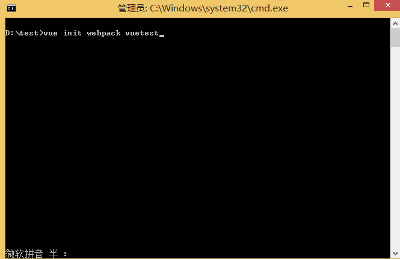
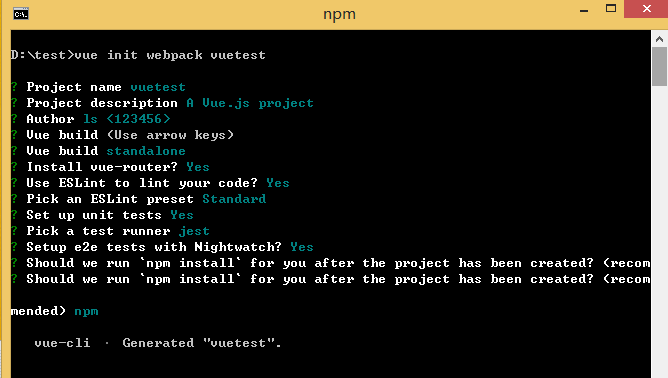
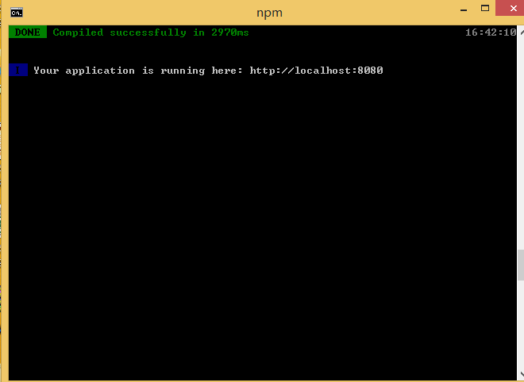

# vue  Tutorial

## Introduce
node.js版本 
  v10.13.0
  
vue 版本
  v2.9.6

webpack 版本
  v4.29.0
## Download

## Installation Steps

### 前置条件
```tcl
  + 安装node.js
  + 安装webpack
     cnpm install webpack -g
  + 安装vue
     cnpm install vue
  + 全局安装 vue-cli
     cnpm install --global vue-cli
```
 ### 安装步骤
   1. 使用webpack模板创建项目，在项目根目录中打开命令窗口并执行以下命令：
   
      vue init webpack projectName         ## projectName为项目名
     
      
     
      创建过程中需要进行一些配置，默认回车即可
      
      
      
      其中：Install vue-router?            ##是否安装vue-router
      
           Use ESLint to lint your code ？##是否使用ESLint管理你的代码  
           
   2. 出现如下信息，说明创建成功；
   
      
     
   3. 进入到项目的根目录中，执行npm run dev 启动vue项目
   
      cd vuetest                            ##进入到项目根目录
     
      npm run dev                           ##启动项目
     
   4. 出现如下界面说明，项目启动成功，即可在浏览器中访问
   
      
      
## Settings
```tcl
 使用VSCode启动vue项目
  1. 安装element-ui插件和引用
      安装：npm i element-ui -S
      引用：在src/main.js中引入
      import ElementUI from 'element-ui'
      import 'element-ui/lib/theme-chalk/index.css'
      Vue.use(ElementUI)
  2. 安装axiox插件和引用
      安装：npm install --save axios vue-axios
      引用：在src/main.js中引入
      import axios from 'axios';
      import VueAxios from 'vue-axios';
      Vue.use(VueAxios, axios)
```
## Command 
    1.启动vue项目
       npm run dev
## Keymap

## Rources
+  https://www.cnblogs.com/wx1993/p/6136892.html
+  https://www.cnblogs.com/hasubasora/p/7118846.html


